```python
import numpy as np
import matplotlib.pyplot as plt
import cv2
```

Ok we going to define a few function here


```python
def convexHullIsPointingUp(hull):
    x, y, w, h = cv2.boundingRect(hull)

    aspectRatio = float(w) / h
    if aspectRatio > 0.8:
        return False

    listOfPointsAboveCenter = []
    listOfPointsBelowCenter = []

    intYcenter = y + h / 2

    # step through all points in convex hull
    for point in hull:
        # and add each point to
        # list of points above or below vertical center as applicable
        if point[0][1] < intYcenter:
            listOfPointsAboveCenter.append(point)

        if point[0][1] >= intYcenter:
            listOfPointsBelowCenter.append(point)

    intLeftMostPointBelowCenter = listOfPointsBelowCenter[0][0][0]
    intRightMostPointBelowCenter = listOfPointsBelowCenter[0][0][0]

    # determine left most point below center
    for point in listOfPointsBelowCenter:

            if point[0][0] < intLeftMostPointBelowCenter:
                intLeftMostPointBelowCenter = point[0][0]

        # determine right most point below center
    for point in listOfPointsBelowCenter:
        if point[0][0] >= intRightMostPointBelowCenter:
            intRightMostPointBelowCenter = point[0][0]

        # step through all points above center
    for point in listOfPointsAboveCenter:
        if point[0][0] < intLeftMostPointBelowCenter or \
         point[0][0] > intRightMostPointBelowCenter:
            return False

    # if we get here, shape has passed pointing up check
    return True
```


```python
def testcone(img, file=''):
    print 'Image shape ', img.shape
    #cv2.imshow('image', img)
    #show what going on
    plt.axis("off")
    plt.imshow(cv2.cvtColor(img, cv2.COLOR_BGR2RGB))
    plt.show()
    # convert to HSV color space, this will produce better color filtering
    imgHSV = cv2.cvtColor(img, cv2.COLOR_BGR2HSV)

    # Threshold on low range of HSV red
    low_redl = np.array([0, 135, 135])
    low_redh = np.array([15, 255, 255])
    imgThreshLow = cv2.inRange(imgHSV, low_redl, low_redh)

    # threshold on high range of HSV red
    high_redl = np.array([159, 135, 135])
    high_redh = np.array([179, 255, 255])
    imgThreshHigh = cv2.inRange(imgHSV, high_redl, high_redh)

    # combine low range red thresh and high range red thresh
    imgThresh = cv2.bitwise_or(imgThreshLow, imgThreshHigh)

    # clone/copy thresh image before smoothing
    imgThreshSmoothed = imgThresh.copy()
    # open image (erode, then dilate)
    kernel = np.ones((3, 3), np.uint8)
    imgThreshSmoothed = cv2.erode(imgThresh, kernel, iterations=1)
    imgThreshSmoothed = cv2.dilate(imgThreshSmoothed, kernel, iterations=1)
    # Gaussian blur
    imgThreshSmoothed = cv2.GaussianBlur(imgThreshSmoothed, (5, 5), 0)
    #cv2.imshow('imgThreshSmoothed ', imgThreshSmoothed)
    # get Canny edges

    imgCanny = cv2.Canny(imgThreshSmoothed, 160, 80)
    #cv2.imshow('imgCanny ', imgCanny)
    image, contours, hierarchy = cv2.findContours(imgCanny,cv2.RETR_EXTERNAL,cv2.CHAIN_APPROX_SIMPLE)

    listOfContours = []
    if len(contours) != 0:
        for cnt in contours:

            # epsilon = 0.1 * cv2.arcLength(cnt, True)
            # print'epsilon',epsilon
            listOfContours.append(cv2.approxPolyDP(cnt, 6.7, True))

    # print file + ' listOfContours ' , len(listOfContours)

    listOfCones = []
    for contour in listOfContours:
            hull = cv2.convexHull(contour)
            # print 'convexHull',len(temp)
            if (len(hull) >= 3 and len(hull) <= 10):
                imghull2 = cv2.drawContours(img.copy(), hull, 1, (0, 0, 255), 5)
                # draw hull on image???
                # print '--hull',len(hull)    #hull.append(temp)
            else:
                continue

            if convexHullIsPointingUp(hull):
                # print '-Point up-'
                listOfCones.append(hull)

    imghull = cv2.drawContours(img, listOfCones, -1, (0, 255, 0), 3)
    #cv2.imshow('hull ', imghull)
    # cv2.imshow('hull 2',imghull2)
    #show what going on
    plt.axis("off")
    plt.imshow(cv2.cvtColor(imghull, cv2.COLOR_BGR2RGB))
    plt.show()
    # remove any inner overlapping cones

    print'Found ', len(listOfCones), ' Cones'

    return
```


```python
import glob
# get the files
files = glob.glob('..\images\*.jpg')

for file in files:
    print 'Processing file ' + file
    testcone(cv2.imread(file, -1), file=file)
    print 'Done Processing file ' + file

```

    Processing file ..\images\1.jpg
    Image shape  (960L, 1280L, 3L)
    


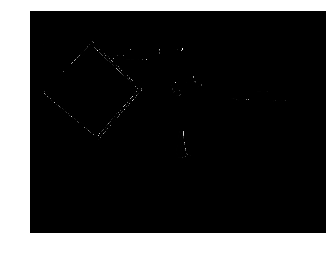


    Found  1  Cones
    Done Processing file ..\images\1.jpg
    Processing file ..\images\10.jpg
    Image shape  (1080L, 1440L, 3L)
    


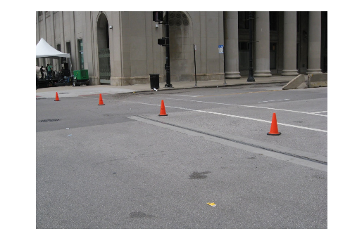


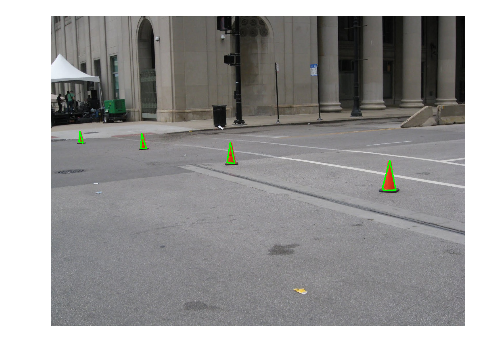


    Found  4  Cones
    Done Processing file ..\images\10.jpg
    Processing file ..\images\11.jpg
    Image shape  (565L, 850L, 3L)
    


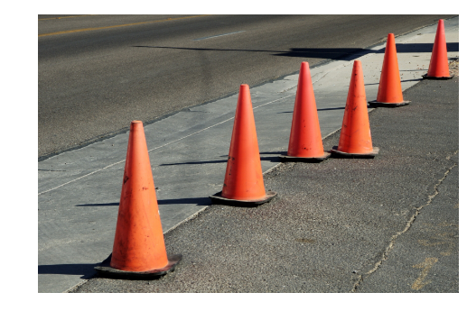


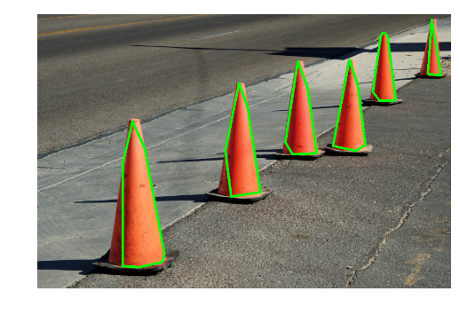


    Found  6  Cones
    Done Processing file ..\images\11.jpg
    Processing file ..\images\12.jpg
    Image shape  (935L, 1034L, 3L)
    


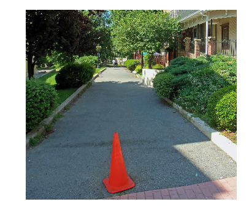


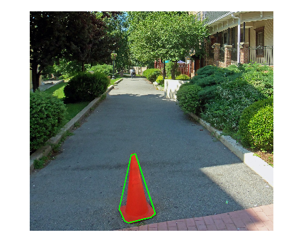


    Found  1  Cones
    Done Processing file ..\images\12.jpg
    Processing file ..\images\13.JPG
    Image shape  (960L, 1280L, 3L)
    


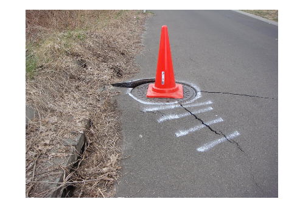


    Found  1  Cones
    Done Processing file ..\images\13.JPG
    Processing file ..\images\14.jpg
    Image shape  (400L, 400L, 3L)
    


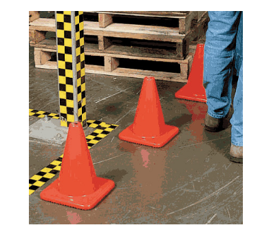


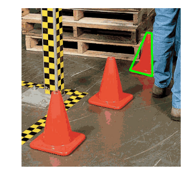


    Found  1  Cones
    Done Processing file ..\images\14.jpg
    Processing file ..\images\2.jpg
    Image shape  (750L, 681L, 3L)
    


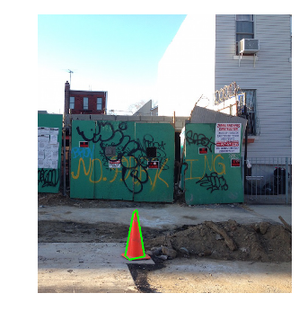


    Found  1  Cones
    Done Processing file ..\images\2.jpg
    Processing file ..\images\3.jpg
    Image shape  (667L, 1000L, 3L)
    


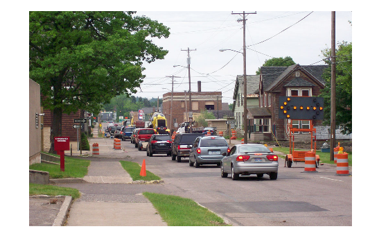


    Found  1  Cones
    Done Processing file ..\images\3.jpg
    Processing file ..\images\4.jpg
    Image shape  (980L, 1306L, 3L)
    


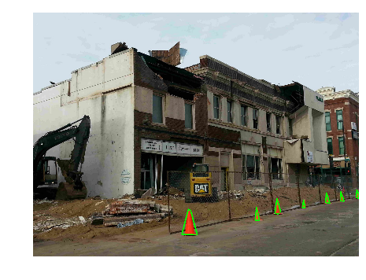


    Found  7  Cones
    Done Processing file ..\images\4.jpg
    Processing file ..\images\5.jpg
    Image shape  (600L, 745L, 3L)
    


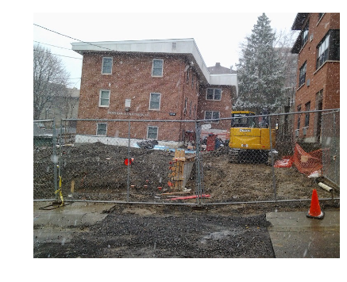


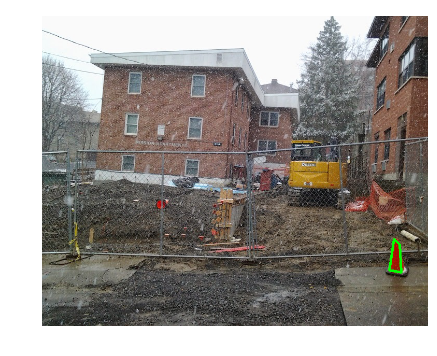


    Found  1  Cones
    Done Processing file ..\images\5.jpg
    Processing file ..\images\6.jpg
    Image shape  (532L, 757L, 3L)
    


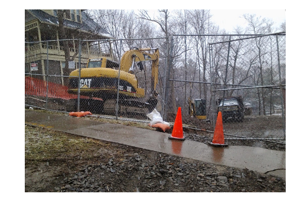


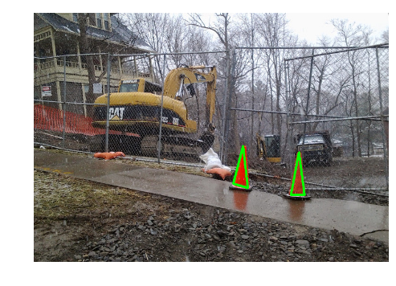


    Found  2  Cones
    Done Processing file ..\images\6.jpg
    Processing file ..\images\7.jpg
    Image shape  (969L, 1412L, 3L)
    


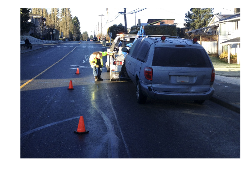


    Found  3  Cones
    Done Processing file ..\images\7.jpg
    Processing file ..\images\8.jpg
    Image shape  (989L, 1318L, 3L)
    


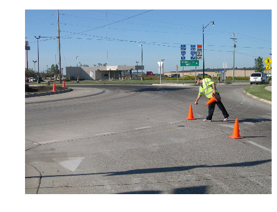


    Found  4  Cones
    Done Processing file ..\images\8.jpg
    Processing file ..\images\9.jpg
    Image shape  (667L, 1000L, 3L)
    


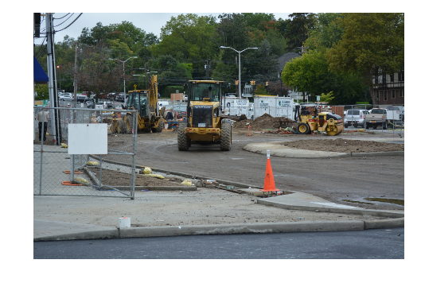


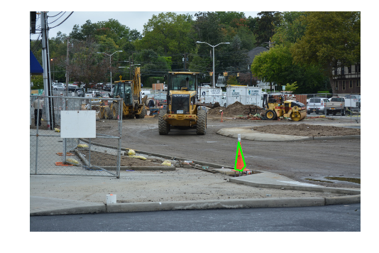


```python

```
